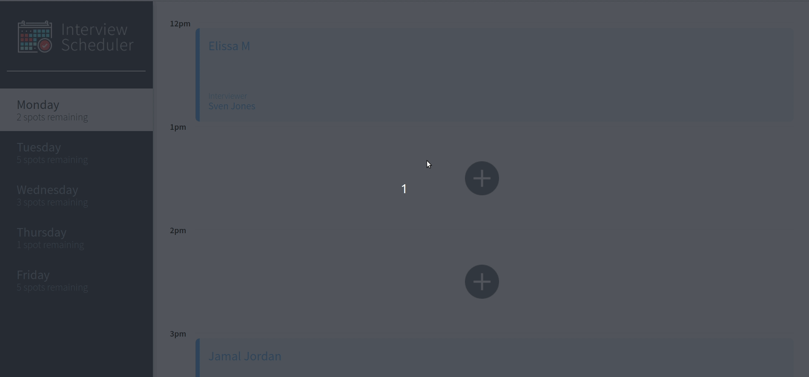

# Interview Scheduler
A simple, single-page application built using React. Users can switch between weekdays and book an interview in an empty appointment slot - the number of available spots will update dynamically. Interviews are booked by typing in a student name and clicking on an interviewer from a list of available interviewers. Users can then cancel and interview or edit details on an existing interview. 

## Netlify-hosted app: 
https://keen-clarke-3d8d06.netlify.com/

## Final Product


## Setup

Install dependencies with `npm install`.

## Running Webpack Development Server

```sh
npm start
```

## Running Jest Test Framework

```sh
npm test
```

## Running Cypress Test Framework

```sh
npm run cypress
```

## Running Storybook Visual Testbed

```sh
npm run storybook
```